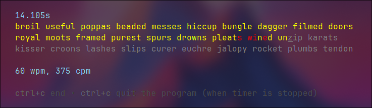

# Speed Type Tester

A CLI application for testing your type speed.

## Installation

- Download Go language. It is necessary for building the application.

    For Arch-based distros use pacman: `sudo pacman -S go` \
    For Red Hat-based distros use dnf: `sudo dnf install golang`

- Download any collection of words. Or create it by yourself.

    You may use package managers for that as well.

    For Arch-based distros: `sudo pacman -S words` \
    For Red Hat-based distros: `sudo yum install words` \
    For Debian and Ubuntu-based distros: `sudo apt-get install wamerican` OR `sudo apt-get install wbritish`

    These collections will be located at `/usr/share/dict/` directory.

    To create a collection of words by yourself, simply put your desirable words into some file so there is only one word in each line. \
    The example of manually created collection of words is the file [assets/word_collection](./assets/word_collection) in this repository.

- Clone this repository into one of your directories.

    Run `git clone git@github.com:hikkiyomi/speed-type-test.git`

- To install the project, simply run `make` from the directory of cloned repository.

    You can also install the project with script [scripts/install.sh](./scripts/install.sh) with providing your custom installation path. \
    Run `./scripts/install.sh . <your-path-here>` from the directory of repository.

- Type `stt` in your terminal and test your typing speed!

## Usage

Run `stt --help` in your terminal to get more information.

The application supports following flags:
- `-t, --timeout int`. Default is 30. Specifies the timeout for timer. If set to 0, the time is unlimited and timer is replaced with stopwatch.
- `-w, --wrap int`. Default is 10. Specifies the amount of words in one line.
- `-i, --input string`. Default is `/usr/share/dict/american-english`. Specifies the word collection.
- `    --minlen int`. Default is 5. Specifies the minimum length of words.
- `    --maxlen int`. Default is 6. Specifies the maximum length of words.

If you have created your own word collection, just put the path to it into the -i (--input) flag.
